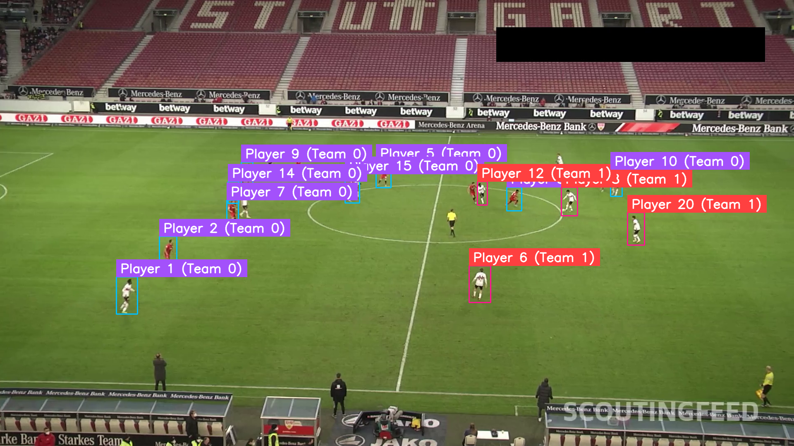
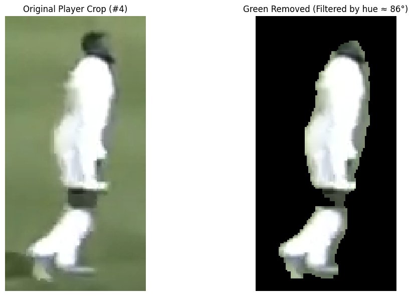
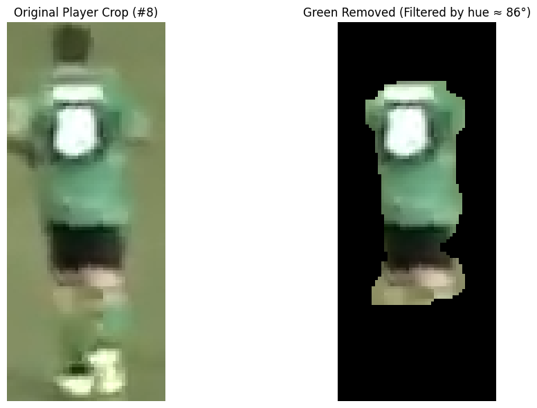
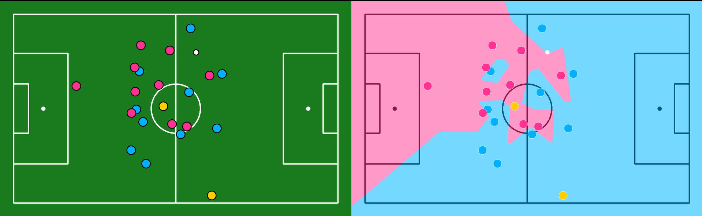
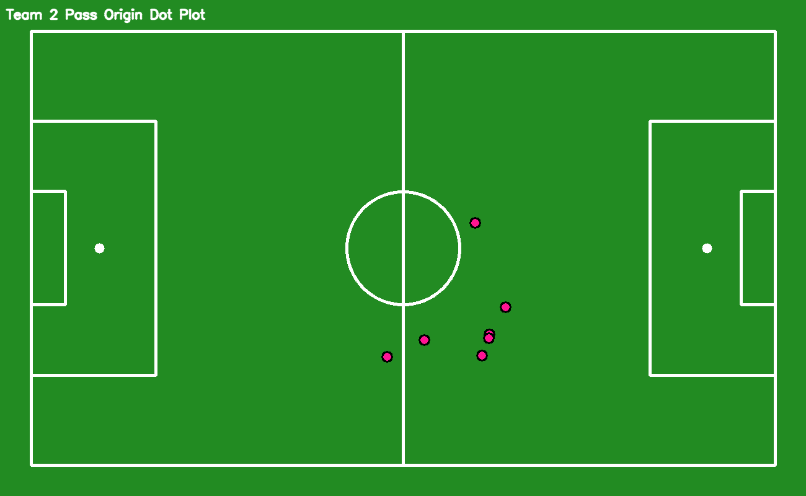
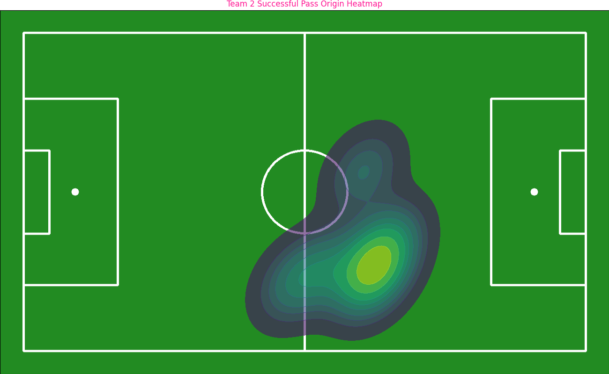
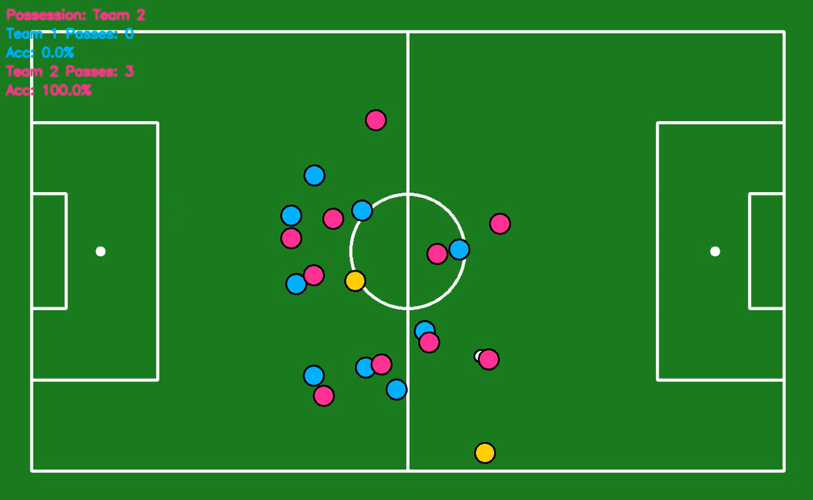

⚙️ Set up:

- Python 3.8+

- OpenCV (cv2)

- NumPy

- scikit-learn

- tqdm

- Supervision

- Ultralytics (YOLO)

- Roboflow

- player/ball-detection model is in "models/best.pt"

- We test the code using videos/images on the "input" folder

- All outputted videos are sent to "output" folder

- Run main code "main.py"

Training Yolo Model: 

We are using two Yolo Models. One for player-ball detection, and one for keypoints detection. 

For keypoints model, we decided to use a pretrained YOLOv8 model from Roboflow (source: https://universe.roboflow.com/roboflow-jvuqo/football-field-detection-f07vi/dataset/15). What makes this easier is that the camera won't be moving because we will have 3 cameras stitched on a 20 foot tripod. Keypoints will be easy to detect

For the player-ball detection, we created our own YOLOv8 model and labeled our own data using USL/FuegoFC games from Youtube

Understanding Homography in Computer Vision:

A Homography matrix is transformation matrix intended to convert the coordinates we have on the camera to the real-time soccer field dimension on a Birds-Eye view. Essentially you are taking 4+ keypoints to be able to calculate the transformation matrix, which then allows you to take player and ball positions and convert them to Birds-Eye view coordinates. By doing this, we will be able to detect when players pass to other players more accurately.

Hue Filtering:
Hue refers to the actual color value, so when Team Classifying players, we need to look into their jersey color, but we run into an issue when we crop the players. The grass can affect how we classify jerseys because grass can take up a big portion of the cropped player image. The way we did it was

2D Gaussian color weighting:
This is a technique using the Gaussian distribution. We know that the center of each player's crop will most likely be the jersey color, so using the 2D Gaussian color weighting technique will put more weight into the center of the image, and less weight into the edges of the image.

Result: 

Voronoi Diagram Soccer:

This Graph shows the estimated field coverage for each team. It uses Eucledian distance on each player to determine which area on the field that player covers. What we want to do is average all of these coverages in each frame and create a heat map to show the average coverage  of each team over the span of a match, or in this case my sample video clip.

Team Passes Dot Plot and Heat map:

The dot plot show the location on where each pass was initialized, and we can make that into a Heat map to show where most passes occur throughout the entire game. This is important in soccer analytics.

Dot plots and Heat maps are created for each Team. Here, I will just show you the outputs for just one team. 

Passes and Pass Accuracy counter(PASS COUNTER NEEDS IMPROVEMENT NOT ACCURATE ENOUGH):

Here we overlay a Team pass and Pass accuracy counter over the birds eye view footage:

Physical Setup (future):

- 3 cameras stitched on a 20 foot tripod showing the entire field

- camera should not be moving

